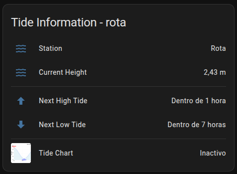
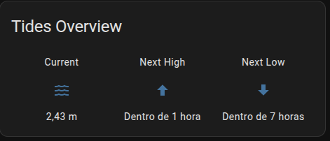
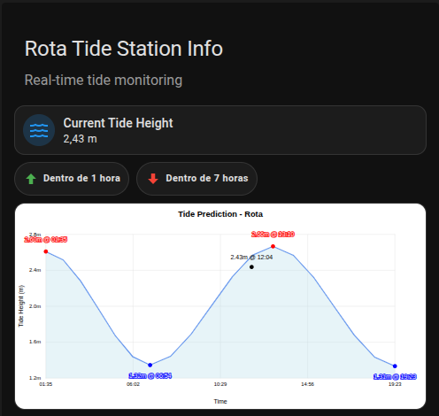
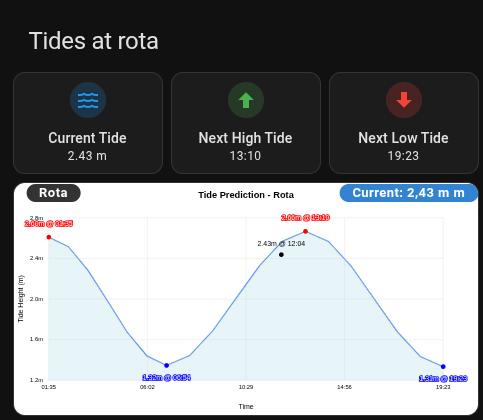
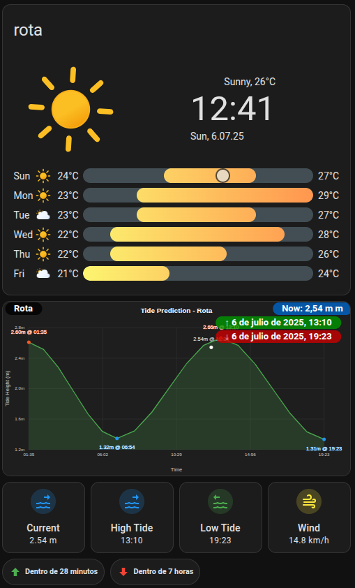

# Modern Tides - Home Assistant Integration

[![GitHub Release][releases-shield]][releases]
[![GitHub Activity][commits-shield]][commits]
[![License][license-shield]](LICENSE)
[![hacs][hacsbadge]][hacs]

[hacsbadge]: https://img.shields.io/badge/HACS-Custom-orange.svg?style=for-the-badge
[hacs]: https://github.com/hacs/integration

A modern Home Assistant custom integration that provides real-time tide information and beautiful visualizations from Spanish tide stations. This integration fetches data from the Instituto Hidrográfico de la Marina (IHM) and provides sensors for current tide height, next high/low tide times, and a visual camera entity showing tide charts.


## Features

- **Real-time tide data** from official Spanish maritime institute
- **Beautiful tide charts** as camera entities (SVG format)
- **Dual visualization modes**: Light and dark theme support with automatic dual camera entities
- **Multiple sensors** for current height and next tide times
- **Easy configuration** through the UI
- **Automatic updates** every 30 minutes
- **Support for multiple stations** simultaneously
- **Modern UI integration** with optimized color palettes for both light and dark interfaces

## Installation

### HACS (Recommended)

1. Make sure you have [HACS](https://hacs.xyz/) installed
2. Go to HACS → Integrations
3. Click the three dots in the top right corner and select "Custom repositories"
4. Add this repository URL: `https://github.com/ALArvi019/moderntides`
5. Select "Integration" as the category
6. Click "Add"
7. Search for "Modern Tides" and install it
8. Restart Home Assistant

### Manual Installation

1. Download the latest release from the [releases page](https://github.com/ALArvi019/moderntides/releases)
2. Extract the contents to your `custom_components` directory:
   ```
   custom_components/
   └── moderntides/
       ├── __init__.py
       ├── manifest.json
       ├── config_flow.py
       ├── const.py
       ├── sensor.py
       ├── camera.py
       ├── tide_api.py
       ├── plot_manager.py
       └── strings.json
   ```
3. Restart Home Assistant

## Configuration

1. Go to **Settings** → **Devices & Services**
2. Click **Add Integration**
3. Search for "Modern Tides"
4. Select your desired tide station from the dropdown list
5. Click **Submit**

The integration will automatically create all necessary entities for your selected station.

For each configured tide station, the following entities will be created:

- **Station information sensor**: General information about the tide station
- **Current height sensor**: Current tide height in meters
- **Next high tide sensor**: Time and height of the next high tide
- **Next low tide sensor**: Time and height of the next low tide
- **Tide plot camera**: Beautiful graphical visualization of the day's tide curve

## Available Entities

After adding a station, you'll have access to these entities (replace `STATION_NAME` with your station's name):

- `sensor.STATION_NAME_tide_station_info` - Station information
- `sensor.STATION_NAME_current_tide_height` - Current tide height in meters
- `sensor.STATION_NAME_next_high_tide_time` - Next high tide time
- `sensor.STATION_NAME_next_low_tide_time` - Next low tide time
- `camera.STATION_NAME_tide_plot` - Tide chart visualization (light mode)
- `camera.STATION_NAME_tide_plot_dark` - Tide chart visualization (dark mode)

### Camera Entities

Two camera entities are created for each station to provide flexible visualization options:

- **Light Mode Camera** (`camera.STATION_NAME_tide_plot`): Traditional white background with blue tide curves, perfect for light-themed dashboards
- **Dark Mode Camera** (`camera.STATION_NAME_tide_plot_dark`): Dark background (#1e1e1e) with green tide curves and enhanced contrast, optimized for dark-themed interfaces

### Visual Specifications

#### Light Mode (`camera.STATION_NAME_tide_plot`)
- **Background**: White (#FFFFFF)
- **Tide curve**: Cornflower blue (#6495ED)
- **Fill area**: Light blue with 30% opacity
- **Grid lines**: Light gray (#D3D3D3)
- **High tide markers**: Red (#FF0000)
- **Low tide markers**: Blue (#0000FF)
- **Text**: Black (#000000)

#### Dark Mode (`camera.STATION_NAME_tide_plot_dark`)
- **Background**: Dark gray (#1E1E1E)
- **Tide curve**: Green (#4CAF50)
- **Fill area**: Green with 20% opacity
- **Grid lines**: Dark gray (#404040)
- **High tide markers**: Orange (#FF5722)
- **Low tide markers**: Light blue (#2196F3)
- **Text**: White (#FFFFFF) and light gray (#CCCCCC)

Both visualizations are generated as scalable SVG files and update automatically with new tide data.

## Dashboard Examples

Explore our collection of dashboard examples to get the most out of your Modern Tides integration. Each example includes detailed instructions, YAML code, and visual previews.

| Example | Description | Features |
|---------|-------------|----------|
| [](examples/01-basic-entity-card/) | **[Basic Entity Card](examples/01-basic-entity-card/)** | Simple list format with all tide information |
| [](examples/02-picture-elements-overlays/) | **[Picture Elements with Overlays](examples/02-picture-elements-overlays/)** | Interactive overlays on tide chart |
| [](examples/03-glance-card/) | **[Glance Card](examples/03-glance-card/)** | Compact three-column view |
| [](examples/04-mushroom-cards/) | **[Mushroom Cards](examples/04-mushroom-cards/)** | Modern design with Mushroom components |
| [](examples/05-preferred-panel-configuration/) | **[Preferred Panel Configuration](examples/05-preferred-panel-configuration/)** | Most informative and visually appealing setup |
| [](examples/06-dark-mode-visualization/) | **[Dark Mode Visualization](examples/06-dark-mode-visualization/)** | Automatic theme switching and dual cameras |
| [](examples/07-comprehensive-weather-tides/) | **[Comprehensive Weather & Tides](examples/07-comprehensive-weather-tides/)** | Complete weather and tide monitoring dashboard |
| [](examples/08-multiple-stations/) | **[Multiple Stations](examples/08-multiple-stations/)** | Side-by-side comparison dashboard |

### Quick Start

1. Choose an example that fits your needs
2. Click on the example link to view detailed instructions
3. Replace `STATION_NAME` with your actual station name (e.g., `cadiz`, `barcelona`)
4. Copy the provided YAML code to your Home Assistant dashboard
5. Enjoy your beautiful tide visualizations!

### Requirements

- Modern Tides integration installed and configured
- For Mushroom card examples: [Mushroom cards](https://github.com/piitaya/lovelace-mushroom) custom component
- At least one tide station configured

## Example Automation

You can create automations based on tide data:

```yaml
automation:
  - alias: "High tide warning"
    trigger:
      - platform: template
        value_template: >
          
          
          {{ time_diff > 59 and time_diff < 61 }}
    action:
      - service: notify.mobile_app
        data:
          title: "Tide Alert"
          message: "Approximately one hour until the next high tide at STATION_NAME"
```

## Data Source

This component uses the public API of the Instituto Hidrográfico de la Marina (IHM):

- Stations API: `https://ideihm.covam.es/api-ihm/getmarea?request=getlist&format=json`
- Daily tides API: `https://ideihm.covam.es/api-ihm/getmarea?request=gettide&id=STATION_ID&format=json&date=YYYYMMDD`
- Monthly tides API: `https://ideihm.covam.es/api-ihm/getmarea?request=gettide&id=STATION_ID&format=json&month=YYYYMM`

## Troubleshooting

If you encounter any issues with the integration:

1. Check Home Assistant logs for specific error messages
2. Make sure your Home Assistant instance has an Internet connection
3. Verify that the integration is properly installed
4. If the problem persists, open an issue in the [GitHub repository](https://github.com/ALArvi019/moderntides/issues)

## Contributing

Contributions are welcome! If you want to improve this component:

1. Fork the repository
2. Create a branch for your feature (`git checkout -b feature/amazing-feature`)
3. Commit your changes (`git commit -m 'Add some amazing feature'`)
4. Push the changes to the branch (`git push origin feature/amazing-feature`)
5. Open a Pull Request

## License

This project is licensed under the MIT License - see the [LICENSE](LICENSE) file for details.

---

Developed by [ALArvi019](https://github.com/ALArvi019) - 2025

[commits-shield]: https://img.shields.io/github/commit-activity/y/ALArvi019/moderntides.svg?style=for-the-badge
[commits]: https://github.com/ALArvi019/moderntides/commits/main
[license-shield]: https://img.shields.io/github/license/ALArvi019/moderntides.svg?style=for-the-badge
[releases-shield]: https://img.shields.io/github/release/ALArvi019/moderntides.svg?style=for-the-badge
[releases]: https://github.com/ALArvi019/moderntides/releases
