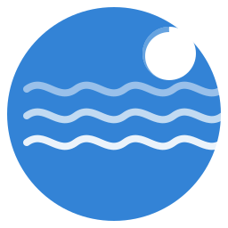

# Modern Tides



A custom component for Home Assistant that provides real-time tide data for Spanish ports using the official API of the Instituto Hidrográfico de la Marina (IHM).

## Features

- Real-time tide queries for Spanish ports
- Shows current tide height
- Detailed information about the next high and low tides
- SVG visualization with tide information
- Customizable update interval per station
- Support for multiple tide ports/stations simultaneously
- Efficient data updates for all stations

## Installation

### HACS Method (recommended)

1. Make sure you have [HACS](https://hacs.xyz/) installed.
2. Add this repository as a custom integration in HACS:
   - Go to HACS > Integrations
   - Click on the three dots in the upper right corner
   - Select "Custom repositories"
   - Add the repository URL: `https://github.com/ALArvi019/moderntides`
   - Select "Integration" as the category
3. Search for "Modern Tides" in the HACS store and install it
4. Install the required dependencies if you don't have them already:
   ```bash
   pip3 install requests
   ```
5. Restart Home Assistant

### Manual Installation

1. Download the latest release from the [GitHub repository](https://github.com/ALArvi019/moderntides)
2. Copy the `custom_components/moderntides` folder to your Home Assistant `<config>/custom_components/` folder
3. Restart Home Assistant

## Configuration

1. Go to Configuration > Integrations
2. Click on "Add integration"
3. Search for "Modern Tides" and select it
4. Follow the instructions to add tide stations:
   - Select the desired station/port
   - Configure a custom name (optional)
   - Set the update interval (default: 1 hour)
5. You can add as many stations as you need

## Created Entities

For each configured tide station, the following entities will be created:

- **Station information sensor**: General information about the tide station
- **Current height sensor**: Current tide height in meters
- **Next high tide sensor**: Time of the next high tide
- **Next low tide sensor**: Time of the next low tide
- **Tide curve camera**: Graphical visualization of the day's tide curve

## Custom Card

Here's an example of a custom `picture-elements` card that you can use to visualize tide data:

```yaml
type: picture-elements
camera_image: camera.station_name_curve_picture
elements:
  - entity: sensor.station_name_tide_station_info
    style:
      background-color: rgba(24, 24, 28, 0.3)
      bottom: 0
      color: white
      font-size: 14px
      left: 0
      line-height: 34px
      padding: 0 15px
      pointer-events: none
      transform: initial
      font-weight: bold
      width: 100%
    type: state-label
  - entity: sensor.station_name_current_tide_height
    style:
      color: white
      font-size: 12px
      line-height: 32px
      margin: 150px 5px
      pointer-events: none
      font-weight: bold
      right: 0
      top: 0
      transform: initial
    prefix: "Current tide height: "
    type: state-label
  - entity: sensor.station_name_next_high_tide_time
    style:
      color: white
      font-size: 12px
      line-height: 32px
      margin: 1px 35px
      pointer-events: none
      font-weight: bold
      right: 0
      top: 0
      transform: initial
    prefix: "Next high tide: "
    type: state-label
  - entity: sensor.station_name_next_high_tide_height
    style:
      color: white
      font-size: 12px
      line-height: 32px
      margin: 30px 35px
      font-weight: bold
      pointer-events: none
      right: 0
      top: 0
      transform: initial
    prefix: "High tide height: "
    type: state-label
  - icon: mdi:arrow-up-bold
    style:
      color: white
      line-height: 32px
      margin: 39px 20px
      pointer-events: none
      right: 0
      top: 0
      transform: scale(0.8)
    type: icon
  - entity: sensor.station_name_next_low_tide_time
    style:
      color: white
      font-weight: bold
      font-size: 12px
      line-height: 32px
      margin: 59px 35px
      pointer-events: none
      right: 0
      top: 0
      transform: initial
    prefix: "Next low tide: "
    type: state-label
  - entity: sensor.station_name_next_low_tide_height
    style:
      color: white
      font-weight: bold
      font-size: 12px
      line-height: 32px
      margin: 84px 35px
      pointer-events: none
      right: 0
      top: 0
      transform: initial
    type: state-label
    prefix: "Low tide height: "
  - icon: mdi:arrow-down-bold
    style:
      color: white
      line-height: 40px
      margin: 88px 20px
      pointer-events: none
      right: 0
      top: 0
      transform: scale(0.8)
    type: icon
```

Replace `station_name` with your station's name (in lowercase and with underscores instead of spaces).

## Data Source

This component uses the public API of the Instituto Hidrográfico de la Marina (IHM):

- Stations API: `https://ideihm.covam.es/api-ihm/getmarea?request=getlist&format=json`
- Daily tides API: `https://ideihm.covam.es/api-ihm/getmarea?request=gettide&id=STATION_ID&format=json&date=YYYYMMDD`
- Monthly tides API: `https://ideihm.covam.es/api-ihm/getmarea?request=gettide&id=STATION_ID&format=json&month=YYYYMM`

## Dependencies

- `requests`: For making HTTP requests to the API

## Troubleshooting

If you encounter any issues with the integration:

1. Check Home Assistant logs for specific error messages
2. Make sure your Home Assistant instance has an Internet connection
3. Verify that dependencies are correctly installed
4. If the problem persists, open an issue in the [GitHub repository](https://github.com/ALArvi019/moderntides/issues)

## Contributing

Contributions are welcome! If you want to improve this component:

1. Fork the repository
2. Create a branch for your feature (`git checkout -b feature/amazing-feature`)
3. Commit your changes (`git commit -m 'Add some amazing feature'`)
4. Push the changes to the branch (`git push origin feature/amazing-feature`)
5. Open a Pull Request

---

Developed by [ALArvi019](https://github.com/ALArvi019) - 2025

## Custom Dashboards for Displaying Tide Data

Here are several examples of how to display tide information in custom Home Assistant dashboards, using different types of cards.

### Complete Tide Dashboard

Here's an example of a complete dashboard with multiple cards to display all data from a tide station (for example, "El Puerto de Santa María"):

```yaml
title: Tide Information
views:
  - title: Tides - El Puerto de Santa María
    cards:
      - type: vertical-stack
        cards:
          - type: markdown
            content: >
              # Tides - El Puerto de Santa María
              
              Updated information about port tides
          
          - type: entities
            title: General Data
            entities:
              - entity: sensor.el_puerto_tide_station_info
                name: Tide Station
              - entity: sensor.el_puerto_current_tide_height
                name: Current Height
                icon: mdi:waves
          
          - type: glance
            title: Upcoming Tides
            entities:
              - entity: sensor.el_puerto_next_high_tide_time
                name: Next High Tide
                icon: mdi:arrow-up-bold
              - entity: sensor.el_puerto_next_low_tide_time
                name: Next Low Tide
                icon: mdi:arrow-down-bold
          
          - type: picture-entity
            entity: camera.el_puerto_curve_picture
            camera_view: auto
            name: Tide Chart
```

### Entity Card

This card displays all tide data in a compact format:

```yaml
type: entities
title: Tides - El Puerto de Santa María
entities:
  - entity: sensor.el_puerto_tide_station_info
    name: Station
  - entity: sensor.el_puerto_current_tide_height
    name: Current Height
    icon: mdi:waves
  - type: divider
  - entity: sensor.el_puerto_next_high_tide_time
    name: Next High Tide
    icon: mdi:arrow-up-bold
  - entity: sensor.el_puerto_next_low_tide_time
    name: Next Low Tide
    icon: mdi:arrow-down-bold
  - type: divider
  - entity: camera.el_puerto_curve_picture
    name: Tide Chart
```

### Advanced Mushroom Card

If you have the custom Mushroom cards installed, you can create a more attractive visualization:

```yaml
type: vertical-stack
cards:
  - type: custom:mushroom-title-card
    title: Tides - El Puerto de Santa María
    subtitle: Instituto Hidrográfico de la Marina
  
  - type: custom:mushroom-template-card
    primary: Current tide height
    secondary: "{{ states('sensor.el_puerto_current_tide_height') }} m"
    icon: mdi:waves
    icon_color: blue
  
  - type: horizontal-stack
    cards:
      - type: custom:mushroom-template-card
        primary: Next high tide
        secondary: >-
          {{ states('sensor.el_puerto_next_high_tide_time') | as_timestamp | timestamp_custom('%H:%M') }}
        icon: mdi:arrow-up-bold
        icon_color: green
      
      - type: custom:mushroom-template-card
        primary: Next low tide
        secondary: >-
          {{ states('sensor.el_puerto_next_low_tide_time') | as_timestamp | timestamp_custom('%H:%M') }}
        icon: mdi:arrow-down-bold
        icon_color: red
  
  - type: picture-entity
    entity: camera.el_puerto_curve_picture
    camera_view: auto
```

### Multiple Stations in a Single Dashboard

If you have multiple stations configured, you can display them all in a single dashboard:

```yaml
type: grid
columns: 2
square: false
cards:
  # First station: El Puerto de Santa María
  - type: custom:mini-graph-card
    name: El Puerto de Santa María
    entities:
      - entity: sensor.el_puerto_current_tide_height
        name: Height
    hours_to_show: 24
    points_per_hour: 2
    icon: mdi:waves
    
  - type: entities
    title: El Puerto de Santa María
    entities:
      - entity: sensor.el_puerto_next_high_tide_time
        name: Next high tide
        icon: mdi:arrow-up-bold
      - entity: sensor.el_puerto_next_low_tide_time
        name: Next low tide
        icon: mdi:arrow-down-bold
        
  # Second station: Santander
  - type: custom:mini-graph-card
    name: Santander
    entities:
      - entity: sensor.santander_current_tide_height
        name: Height
    hours_to_show: 24
    points_per_hour: 2
    icon: mdi:waves
    
  - type: entities
    title: Santander
    entities:
      - entity: sensor.santander_next_high_tide_time
        name: Next high tide
        icon: mdi:arrow-up-bold
      - entity: sensor.santander_next_low_tide_time
        name: Next low tide
        icon: mdi:arrow-down-bold
```

### Custom Card with Weather Information

If you want to combine tide information with local weather:

```yaml
type: vertical-stack
cards:
  - type: weather-forecast
    entity: weather.openweathermap
    name: Weather in El Puerto de Santa María
    
  - type: custom:button-card
    entity: sensor.el_puerto_current_tide_height
    icon: mdi:waves
    name: Current Tide
    show_state: true
    styles:
      card:
        - background-color: var(--primary-color)
        - color: var(--text-primary-color)
      name:
        - font-size: 15px
      state:
        - font-size: 20px
    tap_action:
      action: more-info
      
  - type: custom:apexcharts-card
    header:
      title: Tide Forecast
      show: true
    series:
      - entity: sensor.el_puerto_current_tide_height
        type: line
        stroke_width: 3
        curve: smooth
        name: Tide Height
        color: blue
```

### Ejemplos de Paneles Personalizados

A continuación se muestran varios ejemplos de cómo mostrar la información de las mareas en los paneles de Home Assistant.

### Panel Básico

Para crear un panel básico con la información principal de tu estación (por ejemplo, "El Puerto de Santa María"):

```yaml
type: entities
title: Información de Mareas - El Puerto de Santa María
entities:
  - entity: sensor.el_puerto_tide_station_info
    name: Estación
    icon: mdi:information-outline
  - entity: sensor.el_puerto_current_tide_height
    name: Altura actual
    icon: mdi:waves
  - entity: sensor.el_puerto_next_high_tide_time
    name: Próxima pleamar
    icon: mdi:arrow-up-bold
  - entity: sensor.el_puerto_next_low_tide_time
    name: Próxima bajamar
    icon: mdi:arrow-down-bold
  - entity: camera.el_puerto_curve_picture
    name: Gráfico de marea
```

### Panel Completo con Imagen SVG

```yaml
type: vertical-stack
cards:
  - type: entities
    title: Mareas El Puerto de Santa María
    entities:
      - entity: sensor.el_puerto_current_tide_height
        name: Altura actual de la marea
        icon: mdi:waves
      - entity: sensor.el_puerto_next_high_tide_time
        name: Próxima pleamar
        icon: mdi:arrow-up-bold
        secondary_info: attribute
        format: datetime
      - entity: sensor.el_puerto_next_low_tide_time
        name: Próxima bajamar
        icon: mdi:arrow-down-bold
        secondary_info: attribute
        format: datetime
  - type: picture-entity
    entity: camera.el_puerto_curve_picture
    camera_view: auto
    show_state: false
    show_name: false
```

### Panel con Información Adicional de Altura

```yaml
type: vertical-stack
cards:
  - type: markdown
    content: >
      ## Mareas - El Puerto de Santa María
      
      **Altura actual:** {{ states('sensor.el_puerto_current_tide_height') }} m
      
      **Próxima pleamar:** {{ states('sensor.el_puerto_next_high_tide_time') | as_timestamp | timestamp_custom('%H:%M') }} ({{ state_attr('sensor.el_puerto_next_high_tide_time', 'height') }} m)
      
      **Próxima bajamar:** {{ states('sensor.el_puerto_next_low_tide_time') | as_timestamp | timestamp_custom('%H:%M') }} ({{ state_attr('sensor.el_puerto_next_low_tide_time', 'height') }} m)
  - type: picture-entity
    entity: camera.el_puerto_curve_picture
    camera_view: auto
```

## Automations with Tide Data

You can also create automations based on tide data. For example:

```yaml
# Automation that notifies you when it's one hour before the next high tide
automation:
  - alias: "High tide warning"
    trigger:
      - platform: template
        value_template: >
          
          
          {{ time_diff > 59 and time_diff < 61 }}
    action:
      - service: notify.mobile_app
        data:
          title: "Tide Alert"
          message: "Approximately one hour until the next high tide"
```
