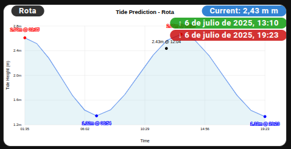

# Picture Elements Card with Overlays

A sophisticated visualization that overlays tide information directly on the tide chart image.

## Features

- Live tide chart as background
- Station name overlay
- Current tide height with blue background
- High tide indicator with green background and up arrow
- Low tide indicator with red background and down arrow
- Rounded corners and semi-transparent backgrounds
- Positioned overlays for optimal visibility

## Screenshot



## Code

```yaml
type: picture-elements
camera_image: camera.STATION_NAME_tide_plot
elements:
  - entity: sensor.STATION_NAME_tide_station_info
    style:
      background-color: rgba(0, 0, 0, 0.8)
      color: white
      font-size: 13px
      line-height: 0px
      padding: 1px 5px
      border-radius: 10px
      pointer-events: none
      font-weight: bold
      left: 40px
      top: 10px
    type: state-label
  - entity: sensor.STATION_NAME_current_tide_height
    style:
      background-color: rgba(0, 100, 200, 0.8)
      color: white
      font-size: 13px
      line-height: 0px
      padding: 1px 5px
      border-radius: 10px
      pointer-events: none
      font-weight: bold
      right: "-70px"
      top: 10px
    prefix: "Current: "
    suffix: " m"
    type: state-label
  - entity: sensor.STATION_NAME_next_high_tide_time
    style:
      background-color: rgba(0, 150, 0, 0.8)
      color: white
      font-size: 13px
      line-height: 0px
      padding: 1px 5px
      border-radius: 10px
      pointer-events: none
      font-weight: bold
      right: "-97px"
      top: 30px
    prefix: "↑ "
    type: state-label
  - entity: sensor.STATION_NAME_next_low_tide_time
    style:
      background-color: rgba(200, 0, 0, 0.8)
      color: white
      font-size: 13px
      line-height: 0px
      padding: 1px 5px
      border-radius: 10px
      pointer-events: none
      font-weight: bold
      right: "-97px"
      top: 50px
    prefix: "↓ "
    type: state-label
```

## Usage Instructions

1. Replace `STATION_NAME` with your actual station name
2. Copy the YAML code above
3. Add it to your Home Assistant dashboard
4. The overlays will appear on top of your tide chart

## Customization Tips

- Adjust `left`, `right`, `top` positions to move overlays
- Change `background-color` rgba values for different colors
- Modify `font-size` for larger/smaller text
- Update `border-radius` for more/less rounded corners

## Requirements

- Modern Tides integration installed and configured
- Tide station with working camera entity

## Difficulty Level

⭐⭐ **Intermediate** - Requires CSS styling knowledge for customization
