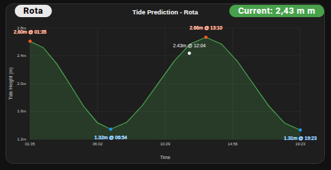
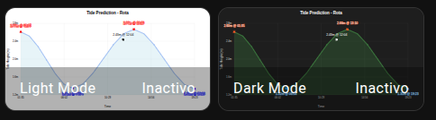

# Dark Mode Visualization

Showcase the new dark mode camera entity theme-based switching for optimal viewing in dark interfaces.

## Features

- **Dark mode camera entity**: Uses `camera.STATION_NAME_tide_plot_dark`
- **Optimized overlays**: Light backgrounds on dark charts for readability
- **Side-by-side comparison**: View both modes simultaneously
- **Theme-aware design**: Perfect for dark Home Assistant themes

## Screenshots

### Dark Mode Camera


### Side-by-Side Comparison


## Code Examples

### Using Dark Mode Camera

```yaml
type: picture-elements
camera_image: camera.STATION_NAME_tide_plot_dark
elements:
  - entity: sensor.STATION_NAME_tide_station_info
    style:
      background-color: rgba(255, 255, 255, 0.9)
      color: black
      font-size: 13px
      line-height: 0px
      padding: 1px 5px
      border-radius: 10px
      pointer-events: none
      font-weight: bold
      left: 40px
      top: 10px
    type: state-label
  - entity: sensor.STATION_NAME_current_tide_height
    style:
      background-color: rgba(76, 175, 80, 0.9)
      color: white
      font-size: 13px
      line-height: 0px
      padding: 1px 5px
      border-radius: 10px
      pointer-events: none
      font-weight: bold
      right: "-70px"
      top: 10px
    prefix: "Current: "
    suffix: " m"
    type: state-label
```

### Side-by-Side Comparison

```yaml
type: horizontal-stack
cards:
  - type: picture-entity
    entity: camera.STATION_NAME_tide_plot
    name: "Light Mode"
    show_name: true
  - type: picture-entity
    entity: camera.STATION_NAME_tide_plot_dark
    name: "Dark Mode"
    show_name: true
```

## Usage Instructions

1. Replace `STATION_NAME` with your actual station name
2. Choose one of the two code examples above
4. Copy the YAML code and add it to your dashboard

## Dark Mode Visual Differences

| Element | Light Mode | Dark Mode |
|---------|------------|-----------|
| Background | White (#FFFFFF) | Dark gray (#1E1E1E) |
| Tide curve | Cornflower blue (#6495ED) | Green (#4CAF50) |
| High tide markers | Red (#FF0000) | Orange (#FF5722) |
| Low tide markers | Blue (#0000FF) | Light blue (#2196F3) |
| Text | Black (#000000) | White (#FFFFFF) |
| Grid lines | Light gray (#D3D3D3) | Dark gray (#404040) |

## Requirements

- Modern Tides integration v1.1.1+ (with dark mode support)
- At least one tide station configured

## Difficulty Level

⭐⭐ **Intermediate** - Basic: Simple camera entity usage  
